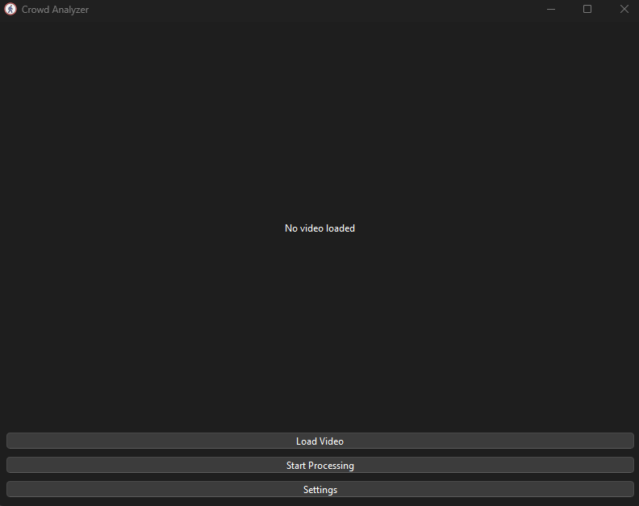
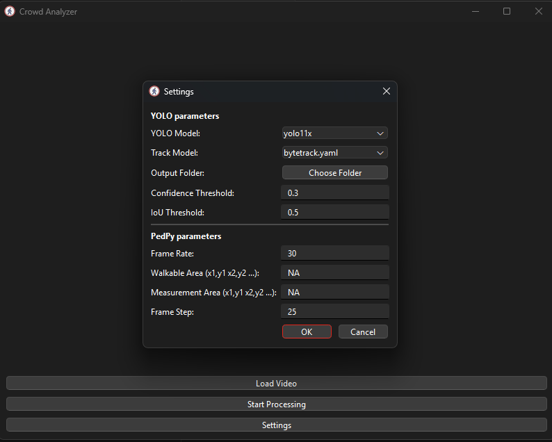
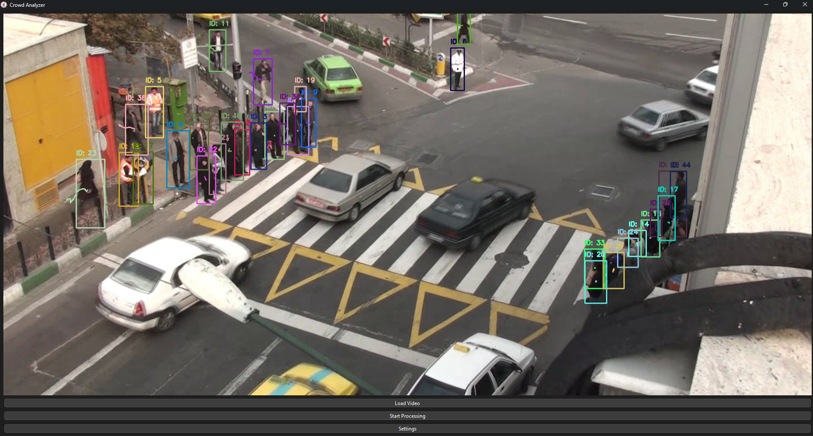
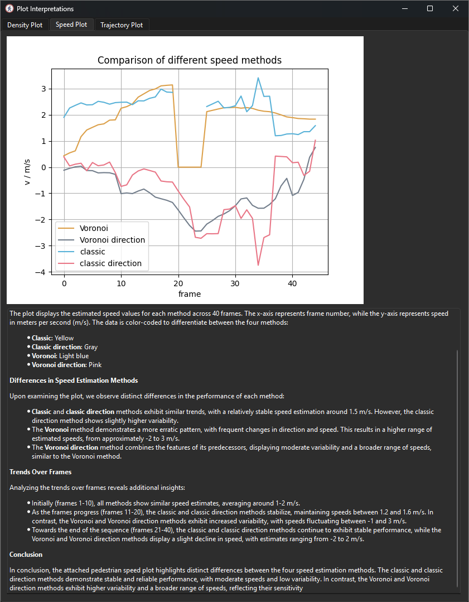

# Crowd Analyzer
Crowd Analyzer is a Python application designed to analyze pedestrian and crowd mobility patterns using computer vision and machine learning techniques. It incorporates YOLO for object detection, Kalman filters for tracking, and various methods for density and speed estimation. 

The application also utilizes [PedPy](https://github.com/PedestrianDynamics/pedpy) to process pedestrian trajectories and [LlamaVision 90B](https://huggingface.co/meta-llama/Llama-3.2-90B-Vision) via the [Groq API](https://console.groq.com/keys) for real-time interpretation of PedPy output plots.

## Features

- Object detection using YOLO
- Kalman filter-based tracking
- Density and speed estimation using Voronoi and classic methods
- Interactive point selection for homography transformation
- Graphical user interface (GUI) using PyQt6
- Visualization of trajectories, density, and speed plots using PedPy
- Real-time plot interpretation using LlamaVision AI

## Demo

### Videos

https://github.com/user-attachments/assets/f16b6d99-86cd-4219-965c-ade446fe8611

https://github.com/user-attachments/assets/72dcb9f9-ba1b-4049-8e87-342af9215d5c


### Screenshots


*Main application interface*


*Settings configuration panel*


*Video processing and tracking visualization*



*Density, Speed and trajectory analysis plots using Pedpy and LllamaVision*



## Installation

1. Clone the repository:
    ```sh
    git clone https://github.com/yourusername/crowd-analyzer.git
    cd crowd-analyzer
    ```

2. Create a virtual environment and activate it:
    ```sh
    python -m venv venv
    source venv/bin/activate  # On Windows use `venv\Scripts\activate`
    ```

3. Install the required dependencies:
    ```sh
    pip install -r requirements.txt
    ```

4. Set up the environment variables:
    - Create a `.env` file in the project root directory.
    - Add your Groq API key to the `.env` file:
        ```
        GROQ_API_KEY=your_groq_api_key
        ```

## Usage

1. Run the application:
    ```sh
    python CrowdAnalyzer.py
    ```

2. Load a video file using the "Load Video" button.

3. Configure settings using the "Settings" button.

4. Start processing the video using the "Start Processing" button.

5. View the results and plots after processing is complete.

## File Structure

- `CrowdAnalyzer.py`: Main application file containing the GUI and core functionality.
- `Tracker.py`: Contains the tracking and density estimation logic.
- `requirements.txt`: Lists the required Python packages.
- `.env`: Environment variables file for storing sensitive information like API keys.

## Contributing

Contributions are welcome! Please fork the repository and submit a pull request for any improvements or bug fixes.

## License

This project is licensed under the MIT License.

